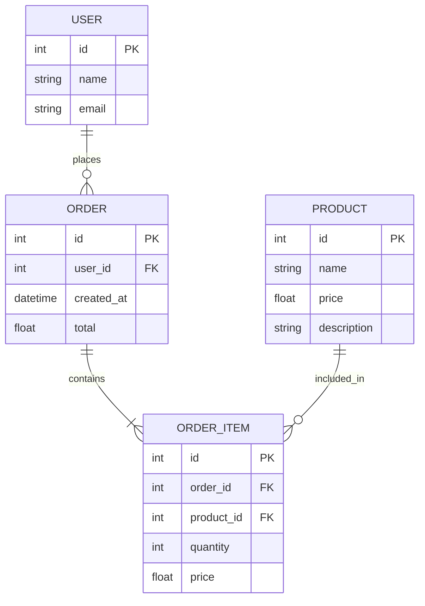
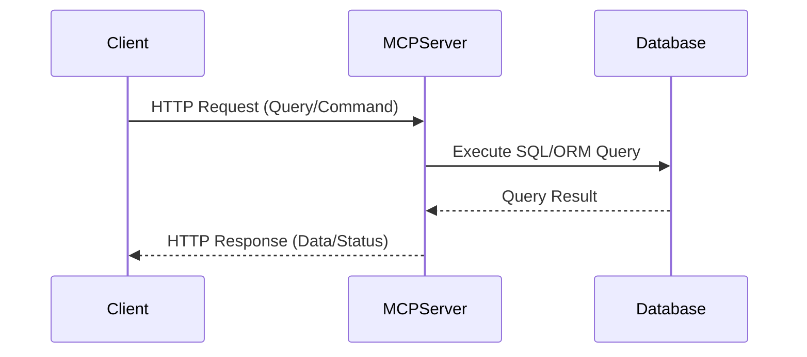

# About the project

This is a PoC for manipulating SQL DBs using MCP servers via HTTP.

## Project Goals

- Develop a robust data model with clear relationships between entities.
- Provide utilities to autopopulate the database for different DB providers.
- Implement an MCP server to enable querying databases over HTTP.
- Organize the repository for collaborative development and structured PRs.
- Explore and compare different approaches: FastMCP vs. FastAPI-MCP.
- Add an authentication layer to secure HTTP streams.
- Propose and design secure management strategies, including redirects, firewall policies, and scalable MCP architecture.

## Scenarios

- A management system for organizing different feedback and projecting them in a visualizable format.
- An ordering system that queries cashflows and projects visualization of it.

## Configuration

### Setting up with `pyproject.toml`, `uv`, and `uvicorn`

1. **Install dependencies using `uv`:**

   ```zsh
   uv pip install -r requirements.txt
   ```

   Or, if you want to use `pyproject.toml` for dependency management, add the following to your `[project]` section:

   ```toml
   # pyproject.toml
   [project]
   dependencies = [
       "uvicorn",
       "sqlmodel",
       # add other dependencies here
   ]
   ```

2. **Running the server with `uvicorn`:**

   You can start your MCP server using:

   ```zsh
   uvicorn sqlmodelmcp.mcpserver:app --reload
   ```

   - Replace `sqlmodelmcp.mcpserver:app` with the actual import path to your FastAPI app if different.
   - The `--reload` flag is useful for development.

3. **Using `uv` for fast dependency management:**

   - `uv` is a fast Python package installer and resolver. It can be used as a drop-in replacement for `pip` and `pip-tools`.
   - To sync your environment with `pyproject.toml`:

     ```zsh
     uv pip sync
     ```

---

## Data Model




## MCP Model

